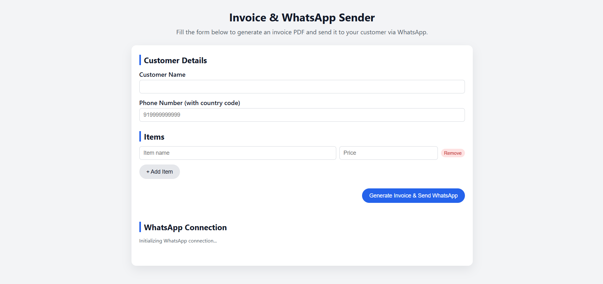

# whatsapp invoice sender

free whatsapp invoice sender built with node.js and electron. send invoice pdf or receipts to customers via whatsapp without using the whatsapp business api.

---



---

## features

- connect your whatsapp account using qr code
- automatically send invoices to customers on whatsapp
- generate invoice pdf
- simple pos checkout integration
- no whatsapp business api required 
- totally free
- works with normal whatsapp number
- open source and easy to modify

---

## how it works

1. open the application
2. go to **settings → whatsapp**
3. scan the qr code using your phone
4. once connected your whatsapp account will appear
5. create a bill or checkout in the pos
6. if the customer has a phone number the invoice is automatically sent on whatsapp

---

## installation

### 1. clone the repository

```bash
git clone https://github.com/jaydipsinh13/whatsapp-invoice-sender.git
```

### 2. open the project folder

```bash
cd whatsapp-invoice-sender
```

### 3. install dependencies

```bash
npm install
```

### 4. start the application

```bash
npm start
```

---

## whatsapp connection

when you open the whatsapp settings page for the first time:

1. a qr code will appear
2. open whatsapp on your phone
3. go to **linked devices**
4. tap **link a device**
5. scan the qr code

once connected the application will show your whatsapp number and connection status.

you can logout anytime from the settings page.

---

## technologies used

- electron
- node.js
- express
- whatsapp-web.js
- pdfkit

---

## notes

this project uses **whatsapp web automation** and does not use the official whatsapp business api.

use responsibly and avoid sending spam messages.

---

## contact

if you are interested in this project, want to build more features, or have any questions, feel free to contact me at: jaydipsinhsolanki9297@gmail.com